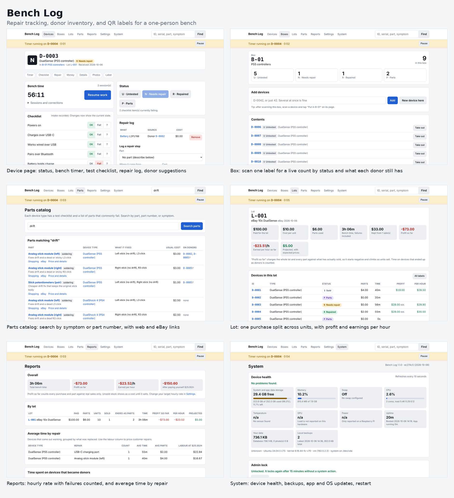

# Bench Log

Repair tracking for a one-person electronics bench. It logs every device that
comes in, what was tested, what was replaced, how long it took, and what it
earned, and it keeps track of donor boards and the parts taken from them.

It runs as a small web app on a Raspberry Pi or any Linux machine. You use it
from a desktop browser or a phone on the same network. Every device and box
gets a QR label that links straight to its page.

## What it does

**Devices and testing**
- A unique ID per device, with status: Untested, Needs repair, Repaired, Parts, Sold
- A test checklist for each device type, saved tap by tap
- The as-received result is frozen at intake, so later changes show what was fixed
- Serial numbers, notes, and photos per device

**Repairs and parts**
- A repair log per device: which part, where it came from, what it cost
- A parts catalog with common failure parts for each device type
- Reverse search by part name, part number, or symptom ("drift", "no charge", "M92T36")
- Part names link to a web search, Google Shopping, eBay buy-it-now, and iFixit
- iFixit and eBay prices side by side for each part, with the difference worked out
- iFixit prices for about 150 parts, with a button to fetch current ones
- Common repairs for each device, with prices, buy links, and iFixit guides
- A saved supplier link per part
- Upgrades and mods listed beside like-for-like parts, starting with GuliKit drift-proof sticks for the Steam Deck, Joy-Con, Switch Lite, DualSense, DualShock 4, Xbox, and Switch Pro controllers
- Optional live price check through the eBay Browse API, with the result shown as a suggestion you confirm

**Donor boards**
- A device that cannot be saved becomes a donor with one click
- Each donor lists which parts are good, suspect, or already taken
- Taking a part records which repair it went to, from either side
- Parts on a donor that match what is failing on the current repair are suggested first

**Boxes and lots**
- A box label is printed once and always shows the live count by status
- A lot splits one purchase price across its devices, so each unit has a true cost

**Time and money**
- Start, pause, and resume a bench timer per device. Only one runs at a time
- Sessions can be corrected, and long ones are flagged in case the timer was left on
- Profit per device, what you earned per hour, and profit after paying yourself a target wage
- Per-lot results that count time spent on failures
- Average bench time by repair type, for pricing customer work

**Labels**
- Label images with a QR code, ID, device type, and status letter
- The QR code holds only a link, so a label never goes out of date
- Sized for 62mm Brother QL tape. Direct printing is planned, see Roadmap

**System page**
- Device health: storage, memory, swap, CPU load and temperature, GPU load where the hardware reports it, uptime, and Raspberry Pi power and throttling warnings
- Automatic daily database backups, plus one before every update, restore, and reboot
- Compare any backup with the current data before touching anything
- Bring back only the records that are missing, or restore a backup in full. Either way the previous state is saved first
- Remote backup to your own server over SSH: dated copies of the database plus the photos, on a schedule, with the server checked every hour
- Pick any copy on the server, download it, and compare or restore it
- One button to make Bench Log start by itself after a reboot
- Check for and install operating system updates, with the package list shown before anything is installed
- Check for and apply Bench Log updates from the git repository, with a database backup first and a button to return to the previous version
- Restart the app or reboot the device
- All of these are locked behind an admin password

**Export**
- Devices, repairs, and time sessions as CSV
- The database, or the database with all photos as one zip

## Experimental features

These are built and covered by automated tests, but have not yet been used on
real hardware or with real customers. They are marked "experimental" in the
app. Expect rough edges and report what breaks.

**Customer repair tickets**
- A ticket per job with a searchable repair ID, the customer's details, the reported problem, how it arrived, and how it goes back
- An express priority that puts the job at the top of the queue, then jobs sorted by promised date
- Quote, amount charged, and return shipping, feeding the same profit and hourly figures as stock repairs
- Turnaround time from received to shipped, alongside bench time
- A printable repair report for the customer: what failed, what was done, and the final check, with no prices on it
- Labels still show only the device ID, never a name

**Change history**
- Every device keeps a dated list of what happened to it: status changes, intake results, repairs, edits, labels printed, and ticket updates

**Encrypted remote backups**
- Each database copy can be encrypted with a passphrase before it leaves the device, so the server only holds unreadable files
- Photos are not encrypted yet
- Keep the passphrase somewhere other than the device. Without it the copies cannot be opened

**Phone alerts**
- A push through ntfy when a backup fails or is overdue, the disk is nearly full, the device overheats, or the Pi reports a power problem
- One message per problem, a reminder after three days, and one more when it clears

**Label printing**
- Direct printing to Brother QL printers over USB or the network, using the `brother_ql` library
- Installed separately from the System page, so a problem with it cannot block other updates
- Not yet tried on a real printer. Print the test label first

## Supported devices out of the box

The catalog is seeded with checklists and parts for:

- DualSense, DualShock 4
- Xbox Series and Xbox One controllers
- Joy-Con (L/R), Joy-Con 2 (L/R), Switch Pro Controller
- Nintendo Switch (original), Lite, OLED, and Switch 2
- Steam Deck LCD and OLED
- PlayStation 5 and PlayStation 4 consoles

More device types, checklist items, and parts can be added in the app. A new
type can start as a copy of an existing one.

Part costs in the catalog are rough placeholders. Set them to what you really
pay. Part numbers are only filled in where they are well known, so check the
marking on the board before ordering a chip.

## Status letters

| Letter | Status | Meaning |
| --- | --- | --- |
| U | Untested | Just arrived |
| N | Needs repair | Tested, something failed |
| R | Repaired | Works and is ready to sell |
| P | Parts | Donor |
| S | Sold | Gone |

## Install

These steps are for Raspberry Pi OS. Any Debian or Ubuntu system works the
same way.

### 1. Get the code

    sudo apt install git python3-venv fonts-dejavu-core rsync openssh-client
    git clone https://github.com/Daggenthal/BenchLog.git ~/benchlog

If the repository is private, the Pi needs its own read-only key first:

    ssh-keygen -t ed25519 -f ~/.ssh/benchlog_deploy -N ""
    cat ~/.ssh/benchlog_deploy.pub

On GitHub, open the repository, then Settings, Deploy keys, Add deploy key.
Paste the line that was printed and leave "Allow write access" off. Then tell
SSH to use that key, and clone through it:

    cat >> ~/.ssh/config <<'EOT'
    Host github.com-benchlog
      HostName github.com
      User git
      IdentityFile ~/.ssh/benchlog_deploy
      IdentitiesOnly yes
    EOT
    git clone git@github.com-benchlog:Daggenthal/BenchLog.git ~/benchlog

### 2. Install and run

    cd ~/benchlog
    python3 -m venv .venv
    .venv/bin/pip install -r requirements.txt
    .venv/bin/python app.py

Open `http://<name-of-your-pi>.local:8080` from any device on the same
network. `hostname` on the Pi prints its name.

### 3. Start at boot

Open System in the app, unlock it, and press "Turn on start at boot". It
writes the service file for wherever the app is installed, enables it, and
lets it run while nobody is logged in. The app restarts once and from then on
comes back by itself after a reboot or power cut.

To do the same by hand:

    mkdir -p ~/.config/systemd/user
    cp ~/benchlog/benchlog.service ~/.config/systemd/user/
    systemctl --user daemon-reload
    systemctl --user enable --now benchlog
    sudo loginctl enable-linger $USER

### Why `.venv/bin/python` and not `python`

The libraries Bench Log needs are installed into the `.venv` folder, not into
the system Python, which Raspberry Pi OS does not let pip modify. Running
`.venv/bin/python app.py` uses the copy of Python that can see them. Once
start at boot is on, you never type this again.

## First steps

1. System: set an admin password.
2. Settings: set your target hourly rate, and the address to print into QR codes.
3. Boxes: create a box, for example "PS5 controllers".
4. Lots: create a lot with what you paid and how many units, then add its devices.
5. Open a device, run the checklist, and tap "Finish intake".
6. Start the timer, log the parts you replace, and mark it repaired.
7. Enter the sale to see profit and what you earned per hour.

To try scanning without a printer, open a device on a desktop and point a
phone camera at the QR code in its Label section.

## Before printing real labels

The QR code contains the address of the app. In Settings, set "Address printed
into QR codes" to a name that will not change, such as
`http://raspberrypi.local:8080`. If the address changes later, labels that
were already printed stop working.

## Updating

Open System, unlock it, and press "Check for updates" under Bench Log updates.
The changes are listed first. "Back up and update" then:

1. Saves a copy of the database.
2. Applies the new code. Your `data` folder is never touched.
3. Installs any new requirements.
4. Restarts the app.

If a step fails, the code is put back as it was. After an update, "Go back to
the previous version" returns to the version you had before.

To update by hand instead:

    cd ~/benchlog
    git pull
    .venv/bin/pip install -r requirements.txt
    systemctl --user restart benchlog

## Your data

Everything you enter lives in the `data` folder, which git ignores:

- `benchlog.db`: the database
- `photos/`: device photos
- `backups/`: automatic and manual database backups
- `secrets.json`: the admin password hash and eBay keys, readable only by your user
- `logs/`: output of update tasks

The database is SQLite: one ordinary file that the app opens directly. There
is no database server to install or keep running.

The last 14 daily backups are kept. They sit on the same disk as the app, so
set up remote backup or download a copy from the System page now and then.

Also in the `data` folder once remote backup is set up:

- `remote_backup_key` and `remote_backup_key.pub`: the key this device uses to sign in to the backup server
- `remote_known_hosts`: the backup server's recorded identity
- `remote.json`: the server address and schedule

The backup encryption passphrase and the alert address are kept in
`secrets.json`.

## Remote backup

Bench Log can copy its data to any server you can reach over SSH.

1. On the System page, under Remote backup, enter the server address, the user
   name (capitals matter), and the folder to use, then save. This creates a
   key pair for this device.
2. The page then shows four lines to paste once on the server. They create the
   folder and allow this device's key to sign in. No password is stored
   anywhere.
3. Press "Test connection", then "Back up to server now".
4. Tick "Back up automatically" to repeat it every few days.

What gets sent:

- A copy of the database named with the date and time, like
  `benchlog-20261006-151002.db`. Each upload is checked against the original
  before it is accepted.
- Photos, into a `photos` folder. Only new files are sent when rsync is on
  both machines. Photos are never deleted on the server.

Older database copies beyond the number you choose to keep are removed,
oldest first. Nothing else on the server is touched.

The server is checked every hour. The System page shows whether it is
reachable, when the last backup landed, how many copies it holds, and how
much space is left, and it warns when a backup is overdue.

### Getting data back

Every copy on the server is listed on the System page. "Download and compare"
fetches one and shows how it differs from what you have now, without changing
anything. From there:

- "Bring back only what is missing" adds records that are in the backup but
  not in the current data, and leaves everything current alone. Use it when
  something was deleted by mistake.
- "Full restore" replaces the database with the backup.

Both make a safety backup first. "Fetch photos from the server" copies photo
files back.

After a total loss, install Bench Log again, enter the same server details,
and add the new key to the server. The copies are then listed and can be
restored.

The connection is encrypted, but the copies on the server are ordinary files.
Use a server and account that only you control.

## Live part prices

This is optional. With a free eBay developer keyset, each part page can show
what the part is selling for right now.

1. Create an account at developer.ebay.com and make a production keyset.
2. In Settings, paste the App ID and Cert ID and pick your marketplace.
3. On any part page, press "Check price on eBay".

The result is a list of fixed-price listings with the lowest, median, and
highest total. Nothing changes until you press "Use". Read the titles first:
cheap results for small parts are often the wrong item or a bulk lot.

### iFixit prices

Bench Log ships with a list of iFixit's prices for the parts it sells, in
`ifixit_prices.json`. It uses the "Part Only" price where iFixit offers one.
About 150 parts have a match. Chip-level parts mostly do not, because iFixit
does not sell them.

To get current numbers on your own device:

- **One part:** open the part and press "Check iFixit price now".
- **All of them:** open Parts and press "Check all iFixit prices". It reads each
  product page once with a pause in between, so it takes a few minutes and runs
  in the background.

Both read the price that iFixit publishes on the product page itself. Only
product pages are requested, never search or the API, and only when you press
the button. If iFixit asks the app to slow down, the check stops and can be run
again later. A price or link you type in is never overwritten by the shipped
list, and neither is one you cleared.

The iFixit button on a part opens its product page when one is known, and
iFixit's parts page for that device otherwise. The part page shows iFixit and
eBay side by side and says which is cheaper and by how much.

### Common repairs

The Repairs page lists, for each supported device, the repairs that come up
most often, most common first. Each one shows the part, your usual cost, the
eBay and iFixit prices, what you have actually paid, the same search and buy
links as the part page, any good donor parts you hold, and a link to the iFixit
guide where one exists. The list ships in `common_repairs.json`.

## Security

- There is no login for everyday pages. Keep the app on your home network and
  do not forward its port to the internet.
- Customer names, addresses, and contact details entered on tickets can be
  read by anyone who can open the app on your network. Keep that in mind
  before entering real customer data, and turn on encryption for remote
  backups once you do.
- Reboot, updates, and backups need the admin password. It is stored as a
  salted hash.
- If the system asks for a password for administrator commands, the System
  page asks for it each time, passes it to `sudo` directly, and does not store
  or log it.
- The page is served over plain HTTP, so passwords typed into it can be read
  by other devices on the same network. On a network you do not fully trust,
  do system tasks over SSH instead.

## Roadmap

- Prove the experimental features on real hardware and move them out of experimental
- A login for everyday pages, now that customer details can be stored
- Stock counts for purchased parts
- Encrypting photos in remote backups
- Customer email notifications

## Development

    .venv/bin/pip install pytest
    .venv/bin/python -m pytest tests -q

| File | Purpose |
| --- | --- |
| `app.py` | Pages and logic |
| `db.py` | Database tables and migrations |
| `catalog.py` | Starting device types, checklists, and parts |
| `labels.py` | Label images |
| `pricing.py` | Part search links and the eBay price check |
| `system.py` | Health, backups, updates, and background tasks |
| `remote.py` | Remote backup over SSH |
| `alerts.py` | Phone alerts through ntfy |
| `printing.py` | Brother QL printing |
| `templates/`, `static/` | The pages |
| `tests/` | Automated tests |

`catalog.py` seeds a new database. On later starts, entries that are new in
`catalog.py` are added to an existing database, but nothing already there is
changed, so costs and names you edited in the app are kept.

Set `BENCHLOG_PORT` to change the port and `BENCHLOG_DATA` to move the data
folder.

## License

MIT. See [LICENSE](LICENSE).
